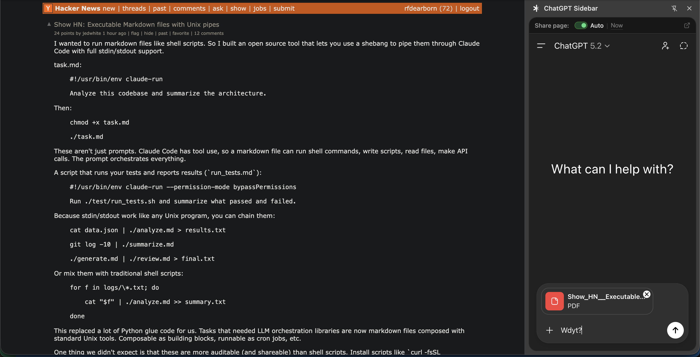

# ChatGPT Sidebar



A simple Chrome extension that provides quick access to ChatGPT in a sidebar with automatic page context sharing.

## Features

- **Real ChatGPT**: Uses the actual chatgpt.com in an iframe, not GPT via API - your conversations sync everywhere.
- **Auto-Share Page**: Automatically attaches the current page context as a PDF every 10 seconds or whenever you send a message (toggle "Auto" to enable or click "Now" to force an immediate attachment).
- **Pop-out Support**: Quickly open your current chat in a full tab and close the sidebar with one click.
- **Keyboard Shortcuts**: Quick access via Option+C (toggle sidebar).

## Installation

1. Open Chrome and go to `chrome://extensions/`
2. Enable "Developer mode" (toggle in top right)
3. Click "Load unpacked"
4. Select this extension folder (`chatgpt-sidebar-extension`)
5. The extension icon should appear in your toolbar

## Usage

1. **Open Sidebar**: Click the extension icon or press `Option+C`.
2. **Log in**: Sign into your ChatGPT account in the sidebar (first time only).
3. **Share page**:
    - **Auto**: Toggle the "Auto" switch on. The extension will now silently keep your page context updated in the ChatGPT composer.
    - **Now**: Click "Now" to immediately print the current tab to PDF and drop it into the chat.
4. **Pop-out**: Click the diagonal arrow icon in the top right to continue your chat in a full browser tab.

## How It Works

The extension uses the Chrome `debugger` API to generate a high-fidelity PDF of your active tab. It then simulates a "file drop" directly into the ChatGPT composer. This bypasses clipboard workflows and cross-origin restrictions while ensuring ChatGPT has the full, rendered context of the page you are viewing.

## Permissions Explained

- `sidePanel`: Display ChatGPT in Chrome's built-in Side Panel.
- `debugger`: Required to generate a PDF of the page and extract text for stable diffing.
- `tabs`: Associate the sidebar with specific browser tabs and handle navigation.
- `storage`: Store your "Auto-Share" preference and chat URLs per tab.
- `declarativeNetRequest`: Used to handle iframe headers for chatgpt.com.

## Privacy

- No data is ever sent to third-party servers beyond whatever's going to/through ChatGPT.
- Page context is only "shared" with ChatGPT when you have "Auto" enabled or click "Now"
- The `debugger` connection is only active while the sidebar is open or "Auto" is enabled.
- All conversations happen directly with OpenAI through your native ChatGPT account.

## Development & Testing

This project uses [Vitest](https://vitest.dev/) for testing and [jest-chrome](https://github.com/samuprolo/jest-chrome) for mocking Chrome extension APIs.

### Setup

```bash
npm install
```

### Running Tests

```bash
# Run tests once
npm test

# Run tests in watch mode
npx vitest

# Generate coverage report
npm run coverage
```
